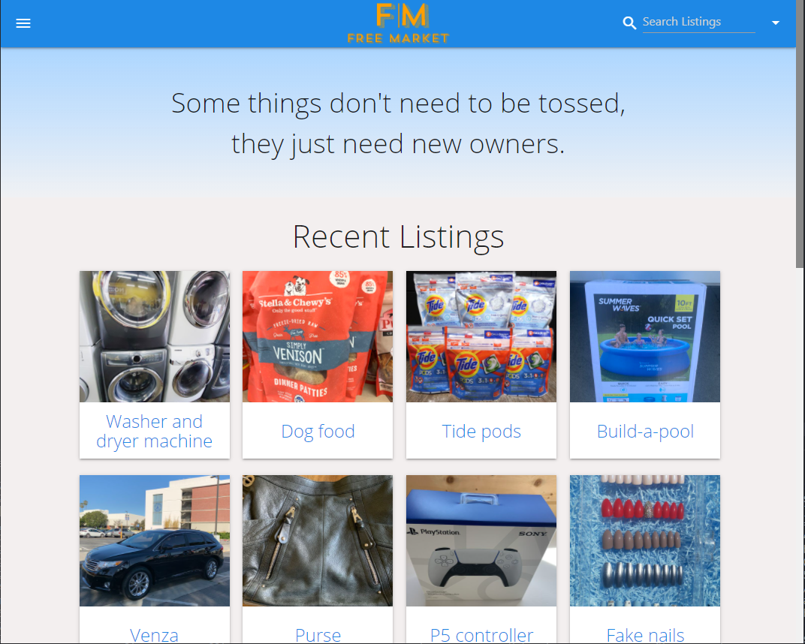
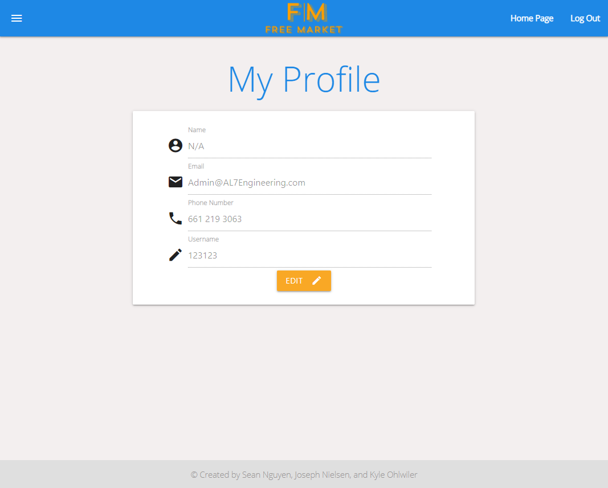

# FreeMarket

## Description
As fellow hoarders, we understand the difficulty of separating from goods. This web application was built to support hoarders find new owners for their items without having to deal with the struggle of a price tag.
### Deployed Link
[FreeMarket](https://mighty-coast-38363.herokuapp.com/)

## FreeMarket Users Can...
- Post a listing of their item with an image, title, and description
- Live search items by their title or category
- Click on cards for more information including connecting with listing owners
- Create and manage their user accounts

## Project Members

- [@someseananigans](https://github.com/someseananigans)
- [@josephmnielsen](https://github.com/josephmnielsen)
- [@Ohskie3](https://github.com/Ohskie3)

## Preview

Home                                         |  Profile
:-------------------------------------------:|:-------------------------------------------:
  |  

## Questions

Feel free to contact us with any questions via github or email:

GitHub:  
- [@someseananigans](https://github.com/someseananigans)
- [@josephmnielsen](https://github.com/josephmnielsen)
- [@Ohskie3](https://github.com/Ohskie3)

Email: 
- [nsean321@gmail.com](nsean321@gmail.com)
- [josephmnielsen@gmail.com](josephmnielsen@gmail.com)
- [kyleohlwiler@gmail.com](kyleohlwiler@gmail.com)
